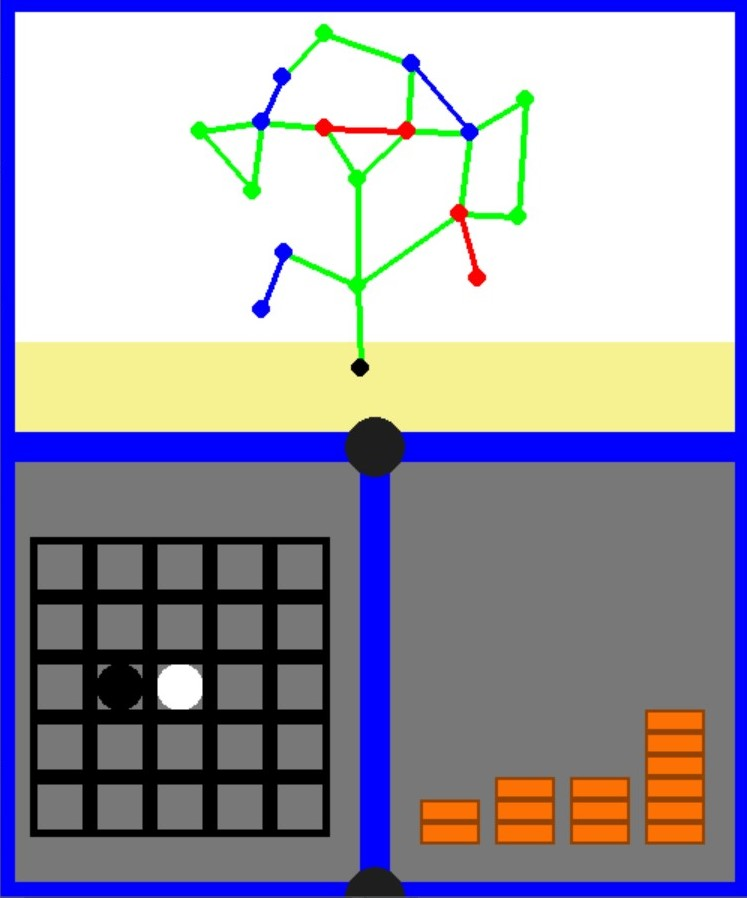

# Combinatorial Game Visualization: Nim, Wythoff Nim, and Hackenbush
This interactive visualization tool allows you to play and explore three classic combinatorial games: Nim, Wythoff Nim, and Hackenbush. The tool allows you to play these games individually or simultaneously.

## Tool Features

- Spin the display with the center button to seamlessly select which game you wish to play a move in.
- Easy to use set up tools to set up any position in each of the three games.
- Optional AI to play against which will always find and play to a P-position (winning position) if such a move exists.

## How to Play

- Set up the three games as desired and select whether the AI plays as blue or red or set the AI to green if you want to play two player.
- Press either the blue or red button to decide who goes first.
- Spin the center to play a move in either Hackenbush, Nim or Wythoff Nim.
- The game will end when there are no moves available to the next player in any of the three games and this player loses. The score will update accordingly.
- There is a semi-hidden button at the bottom to take you back to the set up screen and a semi-hidden button at the top left that will display the grundy values of the games to help you calculate winning moves. The game is in a P-position (previous player winning) when the total Nim-Sum shown in the center is 0.

## The AI Agent
The AI opponent uses sound combinatorial game theory to work out if there is a winning move in the position. It does this by considering every move it has available and calculates the Nim-Sum of the Sprague-Grundy values of the three games for if each of these moves were played. It then plays the move that leaves the Nim-Sum as 0 if there is such a move, if there isnt it plays randomly. In order to calculate the Sprague-Grundy value of the Hackenbush components, the Fusion Principle and the Colon Principle are built into the algorithm. 

  
  <!-- First Image -->
  

    

      
       
      <strong>Game Setup Screen</strong>
    

  

  <!-- Second Image -->
  

    

      
       
      <strong>Gameplay</strong>
    

  

  <!-- Third Image -->
  

    

      
       
      <strong>Gameplay with Grundy Values Visable</strong>
    

  

